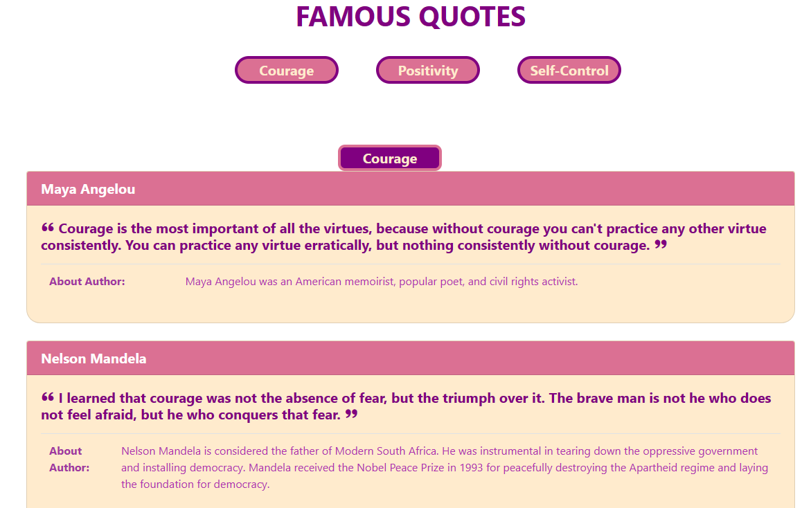

<a href="https://github.com/TennWilliams/Quotes"> Displaying famous quotes on a web page </a>
# Famous Quotes

In this exercise I created cards that display quotes from famous celebrities.  At the top I have a menu with buttons that when click scrolls to the section that have quotes related to the button topic.  I am showcasing linking within the page.

## Future improvments 
I would like to add animation to the cards.

## Run Code
To run this code you must clone this code in VS code and then open the HTML file in a web broswer.
